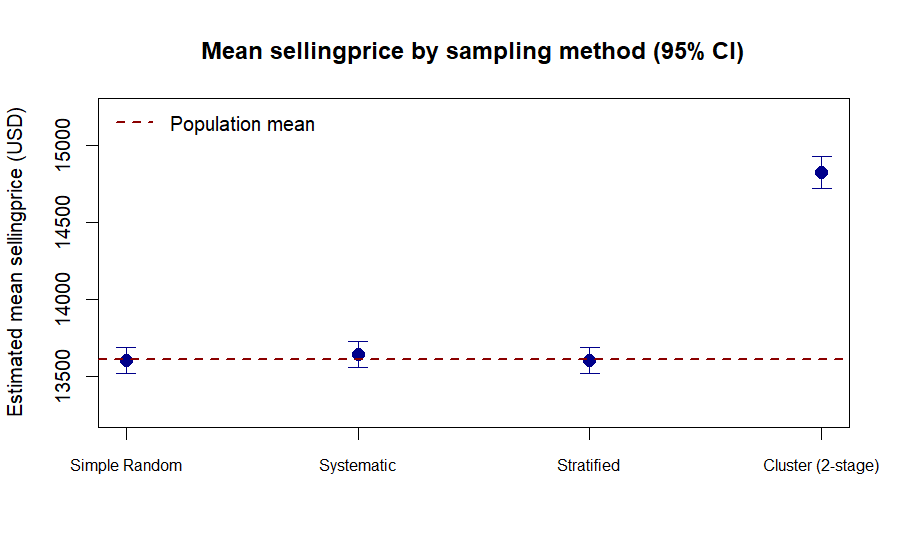

# ADHD Statistical Analysis Assignment

This is a class assignment for the Statistical Methods course at EdgeHub, taught by M.Sc. Axel Torres, due September 25, 2026. It has two parts.

**Part 1** asks for a sampling plan design around a problem of the student's choosing. The problem picked here is estimating how common ADHD is among school-age children and teenagers (6 to 17 years old) in Aguascalientes, Mexico, using a two-stage stratified design (schools, then groups within schools).

**Part 2** asks to draw samples from `data/car_prices.csv`, a vehicle auction dataset with about 559,000 rows, using `set.seed(123)` and `n = 50,000`, then estimate the mean of `sellingprice` with a 95% confidence interval. To make the exercise comparable to Part 1's design, the same seed and sample size are applied across four sampling methods: simple random, systematic, stratified, and cluster.

## Structure

```
├── report/     Part 1 deliverable: the sampling plan, as LaTeX source and compiled PDF
├── notebook/   Part 2 deliverable: the sampling comparison, as a Jupyter notebook (R kernel) and a plain R script
├── data/       car_prices.csv, the dataset used in Part 2
├── figures/    the comparison plot generated by Part 2
└── docs/       instructions.txt, the original assignment prompt
```

## A couple of things worth knowing before reading Part 2

**Cluster sampling comes out biased, and that's the point.** Manufacturer (`make`) is used as the cluster in the two-stage cluster design. Because manufacturers differ a lot in typical selling price, whichever ones happen to get drawn pull the whole estimate toward their own price range. In this run, the cluster estimate landed about $1,200 above the true population mean, with a 95% CI that doesn't even contain it. Simple random, systematic, and stratified sampling all land within about $40 of each other and close to the true mean. See the notebook's interpretation section for how this connects back to the school-clustering risk in Part 1's design.

<p align="center"></p>

**The data needed cleaning first.** Unlike the clean `vehicles.csv` used in a previous assignment, `car_prices.csv` has a few rows with a missing `sellingprice` and a few more with a VIN number spilled into the `state` column, a known data-entry glitch in this dataset. Both get dropped before any sampling.

## Running it

**Part 1** is a static PDF; to rebuild it from source you'll need a LaTeX distribution (MiKTeX or TeX Live) with `xelatex`, since the report uses `fontspec` for a custom font.

**Part 2** needs R with the `dplyr` package. The notebook additionally needs a Jupyter setup with the R kernel (IRkernel). Both `notebook/stage2_sampling_estimates.ipynb` and `notebook/stage2_sampling_script.R` expect to be run from inside the `notebook/` folder, since they reference the dataset as `../data/car_prices.csv`.
